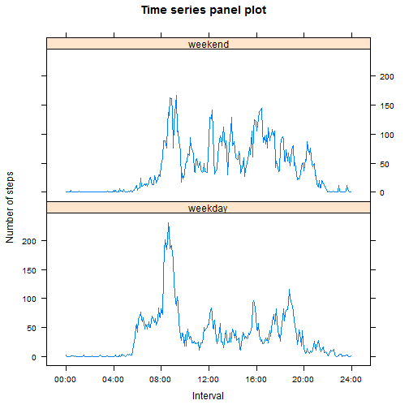

## Loading and preprocessing the data

Set the working directory to the cloned GitHub repo 'RepData_PeerAssessment1'

Unzip the file 'activity.zip' to the working directory

Read data from the unzipped csv file 'activity.csv'


```r
unzip("activity.zip")
my_data <- read.csv("activity.csv", header = TRUE, na.strings = "NA")
names(my_data) <- c("Steps", "Date", "Interval")
summary(my_data)
```

```
##      Steps                Date          Interval     
##  Min.   :  0.00   2012-10-01:  288   Min.   :   0.0  
##  1st Qu.:  0.00   2012-10-02:  288   1st Qu.: 588.8  
##  Median :  0.00   2012-10-03:  288   Median :1177.5  
##  Mean   : 37.38   2012-10-04:  288   Mean   :1177.5  
##  3rd Qu.: 12.00   2012-10-05:  288   3rd Qu.:1766.2  
##  Max.   :806.00   2012-10-06:  288   Max.   :2355.0  
##  NA's   :2304     (Other)   :15840
```


From the summary, it is noted that there are NA values in the original dataset.

Load library for 'dplyr'


```r
library(dplyr)
```


From visual inspection, it is noted that NA values occur on 'missed days' only, i.e. all observations within the 'missed days' will have NA values for 'steps'.

Prepare dataset with NA values removed


```r
nonNA_data <- filter(my_data, !is.na(Steps))
```


## What is mean total number of steps taken per day?

Sum up the total no. of steps taken per day


```r
by_date <- group_by(nonNA_data, Date)
my_agg <- summarize(by_date, sum(Steps))
names(my_agg) <- c("Date", "Total_Steps")
```


Plot histogram of the total no. of steps taken each day


```r
hist(my_agg$Total_Steps, col = "light blue", main = "Histogram", xlab = "Total no. of steps taken each day")
```

 


Calculate the mean of total no. of steps taken per day


```r
mean(my_agg$Total_Steps)
```

```
## [1] 10766.19
```


Calculate the median of total no. of steps taken per day


```r
median(my_agg$Total_Steps)
```

```
## [1] 10765
```


## What is the average daily activity pattern?

Compute the average no. of steps taken for the 5-minute interval, averaged across all days


```r
by_interval <- group_by(nonNA_data, Interval)
my_avg <- summarize(by_interval, mean(Steps))
names(my_avg) <- c("Interval", "Avg_Steps")
```


Make a time series plot of the 5-minute interval (x-axis) and the average no. of steps taken, averaged across all days (y-axis)


```r
my_interval <- c(0:287)
my_df <- cbind(my_avg, my_interval)
names(my_df) <- c("Interval", "Avg_Steps", "My_Interval")

with(my_df, plot(My_Interval, Avg_Steps, type = "l", xaxt = "n", col = "brown", main = "Time series plot", xlab = "5-minute Interval", ylab = "Average no. of steps taken, across all days"))

my_xlab <- c("00:00", "04:00", "08:00", "12:00", "16:00", "20:00")
axis(1, at=c(0, 48, 96, 144, 192, 240), labels = my_xlab)
```

 


Calculate which 5-minute interval, on average across all the days in the dataset, contains the maximum no. of steps


```r
y <- max(my_avg$Avg_Steps)
my_avg[my_avg$Avg_Steps == y, ]
```

```
## Source: local data frame [1 x 2]
## 
##   Interval Avg_Steps
## 1      835  206.1698
```


## Imputing missing values

Calculate the total no. of missing values in the original dataset


```r
sum(is.na(my_data$Steps))
```

```
## [1] 2304
```


Strategy for imputing missing data:

To fill in the missing values in the original dataset, use the mean for that 5-minute interval (i.e. the average no. of steps taken for that 5-minute interval, averaged across all days).  

Note that the mean values have already been computed above and stored in the dataset 'my_avg'.


```r
NA_data <- filter(my_data, is.na(Steps))
mergedData <- merge(NA_data, my_avg, by.x = "Interval", by.y = "Interval")

imputeData <- mergedData %>%
                mutate(Steps = Avg_Steps) %>%
                select(Steps, Date, Interval)

new_data <- rbind(imputeData, nonNA_data)
new_data <- arrange(new_data, Date, Interval)
summary(new_data)
```

```
##      Steps                Date          Interval     
##  Min.   :  0.00   2012-10-01:  288   Min.   :   0.0  
##  1st Qu.:  0.00   2012-10-02:  288   1st Qu.: 588.8  
##  Median :  0.00   2012-10-03:  288   Median :1177.5  
##  Mean   : 37.38   2012-10-04:  288   Mean   :1177.5  
##  3rd Qu.: 27.00   2012-10-05:  288   3rd Qu.:1766.2  
##  Max.   :806.00   2012-10-06:  288   Max.   :2355.0  
##                   (Other)   :15840
```


From the summary, it is noted that there is no more NA value in the new dataset. 

Process new dataset to sum up the total no. of steps taken per day


```r
by_date2 <- group_by(new_data, Date)
my_agg2 <- summarize(by_date2, sum(Steps))
names(my_agg2) <- c("Date", "Total_Steps")
```


Plot histogram of the total no. of steps taken each day


```r
hist(my_agg2$Total_Steps, col = "light green", main = "Histogram (missing values imputed)", xlab = "Total no. of steps taken each day")
```

 


Calculate the mean of total no. of steps taken per day


```r
mean(my_agg2$Total_Steps)
```

```
## [1] 10766.19
```


Calculate the median of total no. of steps taken per day


```r
median(my_agg2$Total_Steps)
```

```
## [1] 10766.19
```


Comparison with first part of the assignment:

After missing values were imputed, the mean value had remained the same, while the median value had increased minimally. 


## Are there differences in activity patterns between weekdays and weekends?

Create a new variable in the dataset 'new_data' to indicate 'weekday' or 'weekend'


```r
new_data <- mutate(new_data, Dayofweek = weekdays(as.Date(Date)))

new_data <- mutate(new_data, Dayfactor = ifelse((Dayofweek == "Saturday")|(Dayofweek == "Sunday"), "weekend", "weekday"))
```


Compute the average no. of steps taken for the 5-minute interval, averaged across all 'weekday' days or 'weekend' days


```r
by_day_interval <- group_by(new_data, Dayfactor, Interval)
new_avg <- summarize(by_day_interval, mean(Steps))
names(new_avg) <- c("Day_Type", "Interval", "Avg_Steps")
```


Load library for 'lattice'


```r
library(lattice)
```


Make a panel plot containing a time series plot of the 5-minute interval (x-axis) and the average no. of steps taken, averaged across all weekday days or weekend days (y-axis)


```r
xyplot(Avg_Steps ~ Interval | Day_Type, data = new_avg, layout = c(1, 2), type = "l", main = "Time series plot", xlab = "Interval", ylab = "Number of steps")
```

 


##### End of assignment
